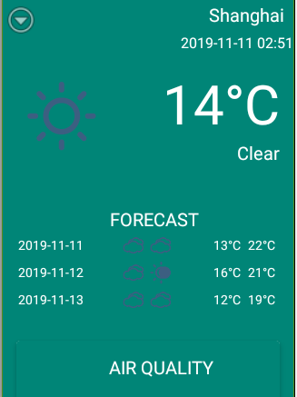
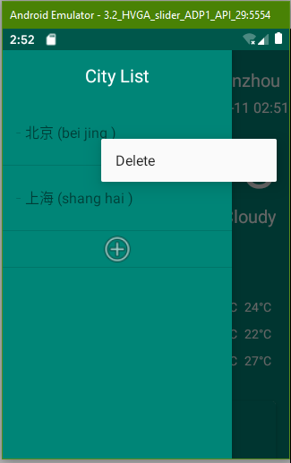

# Weather App 
## Purpose
- To understand web api with RESTful data format;
- To understand how to use OKHttp;
- To understand how to design the database with Sqlite;
- To understand how to use AsyncTask;
- To understand how to design UI for weather forecasting application.

